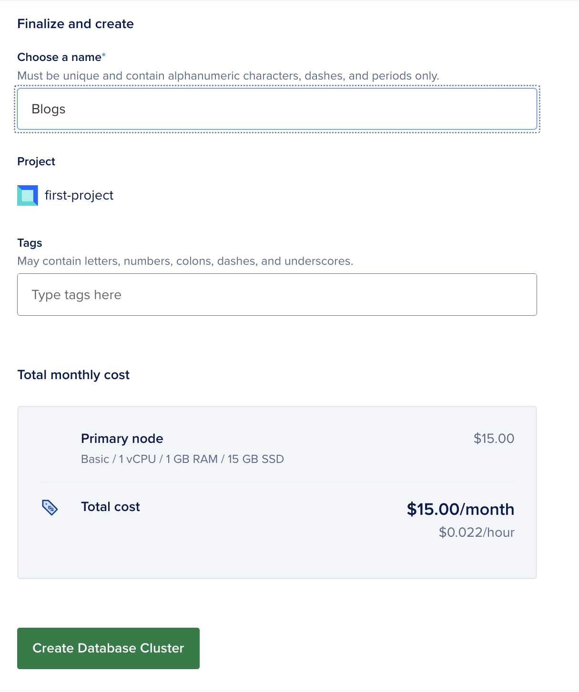
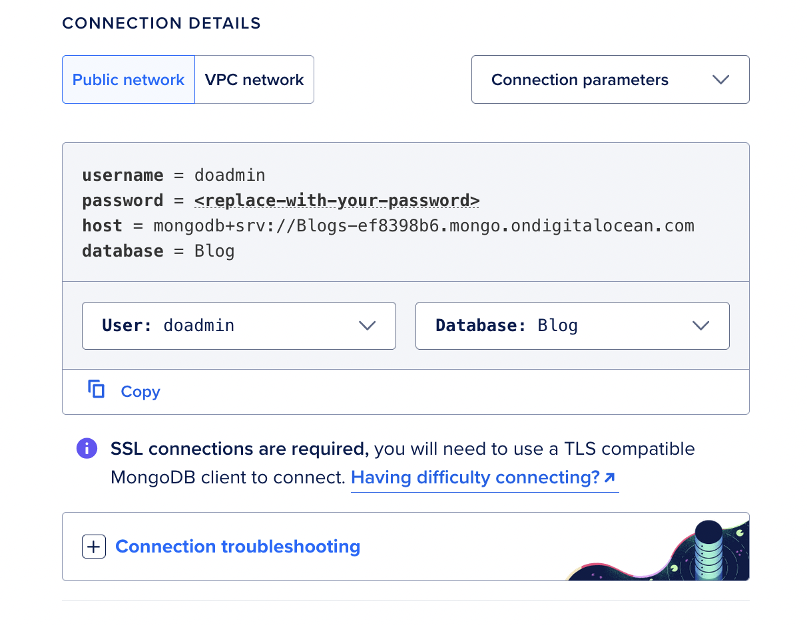
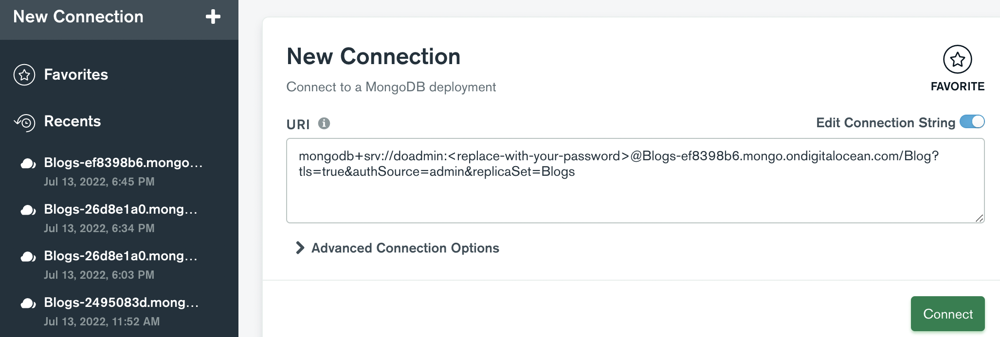

<h1 align="center" id="DO-Serverless"> Digital Ocean Serverless</h1>

<h1 align="center" id="CB-Swap"> Blog application </h1>

<h2 align="center"> Build application using digital ocean Faas</h2>


## What is Serverless or Faas❓
> Serverless architecture is a way to build web applications and services without managing backend infrastructure. In a serverless architecture, cloud providers like DigitalOcean provision, manage, and scale the backend servers and components required to host applications so you can focus on writing and deploying code instead of maintaining the servers that host your applications.

DigitalOcean Functions allow you to deploy pieces of functionality that can perform the same tasks as a traditional API without the requirement of setting up a server to manage the requests. For example, you can write a traditional Node.js function that returns a list of products from a database and then deploy that function to the Functions service. Once deployed, users and applications can retrieve data from the database by making an HTTP request to the function’s URL.

Using serverless functions can make applications more lightweight and secure. Because you only pay for DigitalOcean Functions when a function runs, serverless architecture is often less expensive for apps with variable levels of traffic.

In this tutorial series, you will deploy a Blogs website that uses DigitalOcean Functions to retrieve and post data to a[MongoDB database](https://github.com/docs.digitalocean.com/products/databases/mongodb/)

## 🗒 Content
> The series consists of three parts:

- 1️⃣: Deploy a MongoDB database from the DigitalOcean Control Panel.
- 2️⃣: Set up serverless functions and connect them to the database.
- 3️⃣: Connect the serverless functions to the web app and deploy the site to App Platform.

## About the Application
> The application in this tutorial is an Blogs application with the following functionality:

- Yet to be written.

- Yet to be written.

What tech it uses needs to be written over here

<!-- ## Sample Images -->
<!--  -->

<h2 align="center">Tutorial</h2>

<h2 align="center">Part 1️ - Deploy a MongoDB Database cluster in Digital Ocean</h2>

> In this part of the tutorial, you will:

- Create a MongoDB database cluster and add a database to it.
- Connect to the database cluster.

## Prerequisites

> To complete this part of the tutorial, you need:
- To install the latest version of [MongoDB Compass](https://www.mongodb.com/docs/compass/current/install/) onto your local machine. MongoDB Compass is a GUI for querying, aggregating, and analyzing MongoDB data in a visual environment.

## Step 1️⃣: Deploy and Set Up a MongoDB Database Cluster

To begin setting up the application, you need to create a database to store the blog's data. In this step, you will create a MongoDB database cluster using the DigitalOcean Control Panel and add a new database to it.

To create a MongoDB database from the DigitalOcean Control Panel, click the Create button in the top right of the screen, then select Databases from the drop-down menu.



On the database creation page, select MongoDB in the Choose a database engine section. In the Choose a name field, name the database ```Blog```. The sample code in the rest of this tutorial series expects the database to have this name.

Leave the rest of the configuration options on their default settings and then click Create a Database Cluster to deploy the cluster. This may take several minutes to complete.

Once the cluster has been created, you need to create a new database in the cluster. To do this, from the database’s Overview page, click the Users and Databases tab. In the Databases section, in the Add new database field, enter the name ```Blogs``` and then click Save.

Once you’ve created the new database, click the Overview tab and locate the CONNECTION DETAILS section. This section contains your database’s connection credentials.



Next, in the Connection Parameters drop-down menu, click Connection string. In the Database drop-down menu, click the ```Blogs``` database. The CONNECTION DETAILS section populates with a connection string you can provide to MongoDB Compass to connect to the database cluster. Copy the string to connect to the database in the next step.

## ℹ️ Note : 

> The connection string contains the placeholder value ```<replace-with-your-password>```. If you don’t know the password for your cluster’s admin user, you can reset the password in the cluster’s Users and Databases tab.


## Step 2️⃣: Connect to the Database Cluster

To connect to the database cluster, open MongoDB Compass on your local machine. On the New Connection screen, paste the cluster’s connection string into the URI field, replacing the ```<replace-with-your-password>``` value with your database’s password.




Click <b>Connect</b>. MongoDB Compass connects to the cluster.

<h2 align="center">Part 2 - Add Serverless Functions to App </h2>

> In this part of the tutorial series, you will:

- Configure the app’s environment variables.
- Add Node.js functions to the app that connect to the MongoDB database.
- Deploy and test the functions using the ```doctl``` CLI.

## Prerequisites

To complete this part of the tutorial, you’ll need:

- To fork the sample [Blog](https://github.com/ps99-io/DO-Serverless) repo into your GitHub account and then clone it to your local machine.
- To install the [latest version](https://docs.digitalocean.com/reference/doctl/how-to/install/) of ```doctl```, the official DigitalOcean CLI.
- To install the [latest version](https://nodejs.org/en/) of the Node.js.

## Step 1️⃣: Configure Environment Variables

In the previous part of this tutorial, you copied the database’s connection string and downloaded its CA certificate. In this step you will use these elements to configure the app’s environment variables that it requires to access the MongoDB database.

Similar to most application structures, you can set up a ```.env``` file in the ```blogs-backend``` directory of your project to contain your app’s environment variables. When you deploy your functions, the DigitalOcean Functions service automatically copies the values in the ```.env``` file and makes them available to your functions in the cloud.

To set up the environment variables, create a ```.env``` file in the ```blogs-backend``` directory of the prerequisite repo using the ```nano``` text editor or your preferred text editor:

```sh 
nano .env
```

In the file, paste the following variable into it, replacing the placeholder values with your database’s connection string.

```sh
DB_URI=your_databases_connection_string
```

The resulting file should look something like this:

```sh
DATABASE_URL=mongodb+srv://doadmin:<replace-with-your-password>@Blogs-ef8398b6.mongo.ondigitalocean.com/Blog?tls=true&authSource=admin&replicaSet=Blogs
```
Once you’ve defined the variable, save the file and close it.

## Step 2️⃣: Add Functions to App

Next, you need to add Node.js functions to the app that connect to the MongoDB database cluster and retrieve and post data to the database.

To add functions to your app, you need to create a [special directory](https://docs.digitalocean.com/products/functions/how-to/structure-projects/) called ```packages``` in the backend app’s root directory in our case ```blogs-backend```. The ```packages``` directory is where you add and organize your functions, and it requires a specific structure to ensure that your functions deploy correctly.

Here how it should looks once you create the structure :

```sh
blogs-backend/
│---packages
│   └── blogs
│       ├── createBlogs
│       │   ├── createBlogs.js
│       │   ├── db.js
│       │   └── package.json
│       │
│       ├── deleteBlogs
│       │   ├── deleteBlogs.js
│       │   ├── db.js
│       │   └── package.json
│       │
│       ├── getBlogs
│       │   ├── getBlogs.js
│       │   ├── db.js
│       │   └── package.json
│       │
│       └── updateBlogs
│           ├── updateBlogs.js
│           ├── db.js
│           └── package.json
│
│── .env
│── .gitignore
└── project.yml
```
Each child directory in the ```packages``` directory represents a single package, and each child directory of a package represents a single function. ```packages``` can contain an arbitrary number of packages, and each package can contain an arbitrary number of functions.

In this tutorial, the app contains a ```package``` directory called ```blogs``` which contains four functions: ```createBlogs```, ```getBlogs```, ```deleteBlogs```, ```updateBlogs```.

After you’ve set up the ```package``` directory, navigate to the ```createBlogs``` directory to add your first function.

You can think of each function as its own self-contained Node.js project. This means that the ```package.json``` file your function relies on should be in the same directory as your function.

To initialize the createBlogs directory for a Node.js project, run:

```sh
npm init
```

And then change the entry point to : ```createBlogs.js```

This creates the ```package.json``` file that Node.js uses to track the project’s meta data, dependencies and attributes.
The functions in this tutorial require the [mongoose](https://www.npmjs.com/package/mongoose) module, [MongoDB’s ODM](https://mongoosejs.com/docs/) for Node.js. This allows your functions to connect, retrieve, and post data to the database.

Because functions can be deployed and tested from the cloud, you do not need to install the modules locally. Instead, you can use ```--package-lock-only``` flag to update the ```package.json``` file with the function’s required dependencies without installing them. To update the ```package.json``` file with this function’s dependencies, run:

```sh
npm install --package-lock-only mongoose
```

After updating the function’s dependencies, create a file called ```createBlogs.js``` and ```db.js``` in the createBlogs directory. This file will contain your function’s code.

In the text editor, paste the following code into the db.js file:
```sh
const mongoose = require('mongoose')

const dbURI = process.env.DB_URI;

// establishing connection with the MongoDB database

(
    async () => {
        try {
            await mongoose.connect(dbURI);
            // if connected successfully logging connected successfully
            console.log("Connected to database")
        } catch (error) {
            // logging the error
            console.log(error.message);
        }
    }
)()

```

In the text editor, paste the following code into the createBlogs.js file:
```sh
const mongoose = require('mongoose');

require('./db');

const blogsSchema = new mongoose.Schema({
    title: {
        type: String,
        required: true,
    },
    body: {
        type: String,
        required: true,
    },
});

const Blog = mongoose.model('blogs', blogsSchema);


module.exports.main = async (args) => {
    try {
        if(Object.keys(args).length !==0){
            const blog = await Blog.create(args);
            console.log(blog);
            return {
                statusCode : 201,
                body: blog
            };
        }else{
            return {
                status: 204
            }
        }
    }catch (err) {
        console.log(err);
        return{
            status: 500,
            body: err.message
        }
    }
}
```

This ```db.js``` file configures the MongoDB with the database’s credentials, and establish a connection.

The ```createBlogs.js``` file comments outline its functionality in detail but there are two important pieces to note:

- The line (module.exports.main = main) exports the function as a Node.js module. If a function relies on any external dependencies, you must export the function as a module for it run to correctly on the DigitalOcean Functions service.

- If your function is returning something, the return value must be included in a response body like this:

```sh
return {
    "body": your_data
}
```
After pasting the code into the file, save the file and close it.

```sh
ℹ️ Note : 
1. The ```db.js``` file will be same for the all the individual directory.
2. The project structure is already mentioned above for the reference.
```

Now repeat the same step 2️⃣ for the ```packages/blogs/``` directory with ```deleteBlogs```, ```getBlogs```, ```udpateBlogs``` directory using the same set of dependencies and the following code for the files respectively:

```packages/blogs/deleteBlogs.js```
```sh
const mongoose = require('mongoose');

require('./db');

const blogsSchema = new mongoose.Schema({
    title: {
        type: String,
        required: true,
    },
    body: {
        type: String,
        required: true,
    },
});

const Blog = mongoose.model('blogs', blogsSchema);


module.exports.main = async (args) => {
    
    const {id} = args;
    try {
        const blogs = await Blog.findByIdAndDelete(id);
        return {
            statusCode: 200,
            body : {
                message: "Deleted successfully"
            }
        };
        
    }catch (err) {
        console.log(err);
        return{
            status: 500,
            body: err.message
        }
    }
}
```

```packages/blogs/getBlogs.js```
```sh
const mongoose = require('mongoose');

require('./db');

const blogsSchema = new mongoose.Schema({
    title: {
        type: String,
        required: true,
    },
    body: {
        type: String,
        required: true,
    },
});

const Blog = mongoose.model('blogs', blogsSchema);


module.exports.main = async (args) => {
    try {
        const blogs = await Blog.find();
        if(blogs.length){
            return {
                statusCode: 200,
                body : blogs
            };
        }else{
            return {
                statusCode: 404,
                body: {message: 'Blogs not found'}
            }
        }
        
    }catch (err) {
        console.log(err);
        return{
            status: 500,
            body: err.message
        }
    }
}
```

```packages/blogs/udpateBlogs.js```
```sh
const mongoose = require('mongoose');

require('./db');

const blogsSchema = new mongoose.Schema({
    title: {
        type: String,
        required: true,
    },
    body: {
        type: String,
        required: true,
    },
});

const Blog = mongoose.model('blogs', blogsSchema);


module.exports.main = async (args) => {
    
    const {id, body} = args;
    try {
        const blogs = await Blog.findByIdAndUpdate(id,body);
        // const blogs = await Blog.findById('62ce8a66d030b467b919a6c1');
        // console.log(blogs);
        return {
            statusCode: 200,
            body : {
                message: "Updated successfully"
            }
        };
        
    }catch (err) {
        console.log(err);
        return{
            status: 500,
            body: err.message
        }
    }
}
```

## Congratulations 🎉 you're done with most of the hectic part.😉😎

## Step 3️⃣: Set Up Project Specification

DigitalOcean Functions requires a [YAML specification file](https://docs.digitalocean.com/products/functions/reference/project-configuration/) named ```project.yml``` in the root folder of the app. The ```project.yml``` file is a manifest that lists each function in the app’s packages directory and makes the service aware of any environment variables.

Create a ```project.yml``` file in the root folder:

Paste the following code into the ```project.yml``` file:

```sh
environment: 
  DB_URI: "${DB_URI}"
packages:
  - name: blogs
    actions: 
      - name: createBlogs
        limits:
          timeout: 5000
          memory: 256
      - name: getBlogs
        limits:
          timeout: 5000
          memory: 256
      - name: updateBlogs
        limits:
          timeout: 5000
          memory: 256
      - name: deleteBlogs
        limits:
          timeout: 5000
          memory: 256
```

This ```project.yml``` file declares a package named ```blogs``` with four functions (actions) in it: createBlogs, getBlogs, updateBlogs and deleteBlogs. The environment stanza declares one environment variable in the global scope of the packages directory.

Once you’ve added the code to the file, save the file and close it.

## Step 4️⃣: Deploy and Test the Functions

Once you have added the functions to their respective directories, updated their ```package.json``` files with their dependencies, and configured the ```project.yml``` file, you can deploy the functions to DigitalOcean and test them from the command line using doctl.

To deploy the functions, start by connecting to the development namespace:

```sh
doctl serverless connect
```
The development namespace is where you can test functions in the cloud before deploying them to App Platform.

Once connected, deploy the function by running the following command from the app’s root directory which in our case ```blogs-backend```:

```sh
doctl sls deploy .
```
A successful deploy returns output that looks like this:

```sh
Deployed functions ('doctl sbx fn get <funcName> --url' for URL):
  - blogs/createBlogs
  - blogs/getBlogs
  - blogs/updateBlogs
  - blogs/deleteBlogs
```

Finally, you can test a function by running the functions ```invoke``` command:

```sh
doctl sls functions invoke blogs/getBlogs
```

To retrieve the function’s URL, use the ```serverless functions``` get command with the ```--url``` flag or you can retrieve it from Digital Ocean Function's control panel:

```sh
doctl serverless functions get cloud/getCoffee --url
```
You can copy and paste the returned URL into your API testing platform to test the function execution and verify response.

# Finally you're done with succcessfully deploying and testing the functions...... Phewwww!!!!


<h2 align="center">Part 2 - Add Serverless Functions to App </h2>


## Serverless Tech Stacks & dependencies

##### 🌟 Frontend
- 

##### 🌟 Backend
- Nodejs
- DigitalOcean Functions
- MongoDB

## made with 💕 by 👨‍💻: 
- [Preetam Sarkar](https://github.com/Leoravoe)
- [Anil](https://github.com/)
